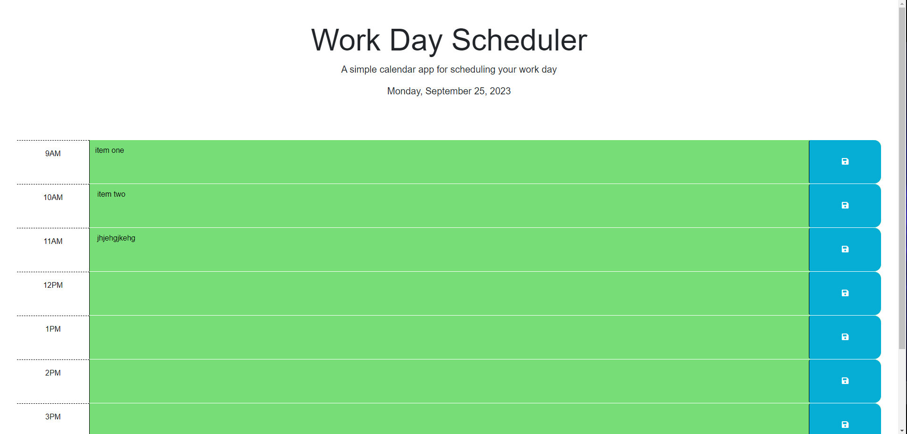

# Workday-Schedule

## Description
A workday schedule to help organize your workday from 9am - 5pm with ability to store task.
link to live site: https://ryanpersaud03.github.io/work-day-scheduler/

## Languages
### HTML, CSS, Jquery, JavaScript 

## Installation
N/A

## Usage
Click on an hour box to add task then click save button to save task to local storage.
## Credits
N/A

## Liscense
Please refer to the LISCENSE in the repo.